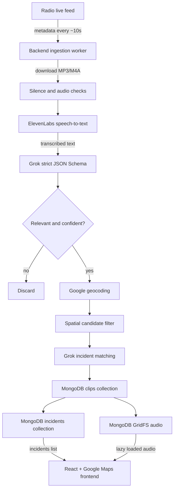

# RadioTrace

Turn police radio into a live, map-based public-safety intelligence feed for Atlanta. Continuously discovers radio clips, transcribes them, filters out irrelevant traffic, extracts incident data, geocodes locations, groups follow-up transmissions with existing incidents, and presents the result in a map interface.

Made for HackGT 13

## Core Features

- Backend-owned radio ingestion loop with configurable polling interval.
- MP3 and M4A support.
- Blank and low-information audio rejection before persistence.
- ElevenLabs speech-to-text with police-radio key terms.
- Strict xAI/Grok JSON Schema output for incident extraction and incident matching.
- Relevance categories including `violent_crime`, `traffic_collision`, `fire`, `medical_emergency`, `missing_person`, `public_safety_threat`, `property_crime`, and `other_crime`.
- Configurable relevance and location-confidence thresholds.
- Location inheritance for follow-up transmissions that match an existing incident but do not repeat its location.
- Two-tier incident matching: geographic candidate filtering followed by semantic matching.
- MongoDB for incident and clip metadata.
- GridFS for audio storage and streaming.
- Interactive Google Map with category-specific icons and severity-based colors.
- Lazy audio playback: metadata and transcript details load when a specific clip is played.
- Manual clip upload for external MP3/M4A analysis.
- Live incident retrieval
- Fully dockerized!

## Architecture



Clips are not written to the database or referenced by an incident until they pass the audio, transcript, relevance, confidence, location, and matching filters.

## Technology

- **Frontend:** React, TypeScript, Vite, `@vis.gl/react-google-maps`, Lucide React
- **Backend:** Python, Flask, Gunicorn
- **Database:** MongoDB 8 with PyMongo and GridFSBucket
- **Speech-to-text:** ElevenLabs Scribe
- **Incident extraction and matching:** xAI Grok through the OpenAI-compatible chat completions API
- **Geocoding and map:** Google Maps Geocoding API and Maps JavaScript API
- **Radio source:** Broadcastify Atlanta police radio playlist
- **Deployment:** MongoDB Atlas, Docker Compose, Nginx

## Quick Start

### Prerequisites

- Docker Desktop with Docker Compose
- API keys for the services you want to enable:
  - ElevenLabs
  - xAI/Grok
  - Google Maps

Broadcastify ingestion depends on the configured playlist being reachable from the backend container.

### Configure environment

From the repository root:

```sh
cp .env.example .env
```

Fill in the API keys in `.env`. Never commit `.env` or expose backend API keys through frontend `VITE_*` variables.

At minimum, the AI pipeline needs:

```dotenv
ELEVENLABS_API_KEY=your-elevenlabs-key
XAI_API_KEY=your-xai-key
GOOGLE_MAPS_API_KEY=your-google-maps-key
VITE_GOOGLE_MAPS_API_KEY=your-google-maps-key
```

The Google Maps key is used in two places for different purposes: backend geocoding and frontend map rendering.

### Start the full stack

```sh
docker compose up --build
```

Open the application at:

- Frontend: <http://localhost:8080>
- Backend health: <http://localhost:5050/api/health>
- MongoDB: `localhost:27017`

Run detached:

```sh
docker compose up --build -d
```

Follow backend ingestion logs:

```sh
docker compose logs -f backend
```

You should see messages such as:

```text
[radio-ingestion] scheduler started; interval=10.0s
[radio-ingestion] poll starting
radio ingestion stored 2 new clips
```

## Backend Configuration

The root `.env.example` documents the full configuration. The most important runtime controls are:

| Variable | Default | Purpose |
| --- | --- | --- |
| `CITY` | `Atlanta` | Primary city context for prompts and fallback coordinates |
| `MONGO_DATABASE` | `radiotrace` | MongoDB database name |
| `GRIDFS_BUCKET` | `audio` | GridFS bucket for stored audio |
| `ELEVENLABS_STT_MODEL` | `scribe_v2` | ElevenLabs transcription model |
| `GROK_MODEL` | `grok-3-mini` | xAI model used for extraction and matching |
| `HTTP_TIMEOUT_SECONDS` | `20` | External request timeout |
| `ENABLE_RADIO_INGESTION` | `true` | Enable the backend radio worker |
| `RADIO_INGEST_INTERVAL_SECONDS` | `10` | Delay between ingestion polls |
| `RADIO_INGEST_LIMIT` | `5` | Maximum current clips considered per poll |
| `MIN_RELEVANCE_CONFIDENCE` | `0.65` | Minimum incident confidence for admission |
| `MIN_LOCATION_CONFIDENCE` | `0.3` | Minimum location confidence before geocoding |
| `INCIDENT_RETENTION_MINUTES` | `60` | Incident cleanup age |
| `INCIDENT_CLEANUP_INTERVAL_MINUTES` | `20` | Cleanup worker interval |
| `ENABLE_INCIDENT_CLEANUP` | `true` | Enable incident retention cleanup |

The frontend build accepts these Vite variables:

| Variable | Default | Purpose |
| --- | --- | --- |
| `VITE_API_BASE` | `/api` | API base path used by the browser |
| `VITE_GOOGLE_MAPS_API_KEY` | empty | Google Maps JavaScript API key |
| `VITE_GOOGLE_MAP_ID` | `radiotrace-atlanta` in code | Google map styling ID |
| `VITE_RADIO_CLIP_LIST_URL` | `/api/radio/clips` | Persisted clip metadata endpoint |
| `VITE_RADIO_CLIP_FILE_URL` | `/api/radio/clips/file` | Persisted clip audio endpoint |

## Data Model

### `clips` collection

Each accepted clip is a MongoDB document. The binary audio is stored in GridFS and referenced by `audio_id`.

```json
{
  "id": "Mongo ObjectId as a public string",
  "hash": "Broadcastify hash",
  "systemId": "Broadcastify system ID",
  "encoding": "mp3",
  "filename": "1790481839-19390.mp3",
  "metadata": {
    "start_time": 1790481839,
    "end_time": 0,
    "transcript": "Transcript text"
  },
  "source_key": "deduplication key",
  "audio_id": "GridFS file ID",
  "stored_at": "UTC timestamp"
}
```

### `incidents` collection

Incidents reference clips by ID rather than embedding audio or duplicating clip metadata.

```json
{
  "id": 42,
  "recordings": ["clip-document-id-1", "clip-document-id-2"],
  "location": [
    {
      "google_maps": "Peachtree Street NE, Atlanta, GA",
      "latitude": 33.759,
      "longitude": -84.388,
      "confidence": 0.83
    }
  ],
  "type": [
    {
      "severity": "Severe",
      "description": "Car crash with two casualties",
      "confidence": 0.83,
      "category": "traffic_collision"
    }
  ],
  "severity": "Severe",
  "category": "traffic_collision",
  "confidence": 0.83,
  "last_updated": 1790481900
}
```

Reference schemas live in [`schemas/Incidents.json`](schemas/Incidents.json) and [`schemas/clips.json`](schemas/clips.json).

## Admission And Analysis Pipeline

The pipeline intentionally does not persist audio immediately:

1. Download audio into memory.
2. Reject empty, too-small, or near-uniform audio.
3. Transcribe with ElevenLabs.
4. Reject empty transcripts.
5. Ask Grok for strict JSON Schema output.
6. Reject categories such as administrative traffic, routine radio, noise/gibberish, or unknown content.
7. Reject relevance confidence below `MIN_RELEVANCE_CONFIDENCE`.
8. Geocode only relevant clips with sufficient location confidence.
9. Search for nearby recent incidents within the spatial candidate threshold.
10. Ask Grok whether the transcript belongs to one of those incidents.
11. If a location is missing but an existing incident matches, inherit that incident’s location.
12. Reject unmatched clips without a usable location.
13. Store the accepted clip in MongoDB/GridFS.
14. Create a new incident or prepend the clip ID to an existing incident.

Grok responses use xAI strict JSON Schema output rather than prompt-only JSON instructions. The schema requires the relevance, category, severity, description, confidence, location, and location-confidence fields.

## API Reference

### Health and configuration

| Method | Endpoint | Description |
| --- | --- | --- |
| `GET` | `/api/health` | Backend health and city status |
| `GET` | `/api/config` | Public city and map configuration |

### Incidents

| Method | Endpoint | Description |
| --- | --- | --- |
| `GET` | `/api/incidents` | List incidents for the map and sidebar |
| `GET` | `/api/incidents/{id}` | Fetch one incident |
| `POST` | `/api/incidents` | Create an incident document |
| `POST` | `/api/incidents/seed` | Seed demo incidents when available |

### Radio clips

| Method | Endpoint | Description |
| --- | --- | --- |
| `GET` | `/api/radio/clips` | List persisted accepted clip documents |
| `GET` | `/api/radio/clips/{clip_id}` | Fetch one clip’s metadata and audio URL |
| `GET` | `/api/radio/clips/file/{clip_id}` | Stream the clip’s MP3/M4A audio from GridFS |

### Manual processing

| Method | Endpoint | Description |
| --- | --- | --- |
| `POST` | `/api/pipeline/process` | Analyze an uploaded MP3 or M4A clip |
| `POST` | `/api/audio` | Legacy direct GridFS upload endpoint |
| `GET` | `/api/audio/{file_id}` | Legacy direct GridFS audio stream |

Example manual upload:

```sh
curl -X POST http://localhost:5050/api/pipeline/process \
  -F "file=@clip.m4a" \
  -F "start_time=0" \
  -F "end_time=30"
```

## User Experience

The frontend is designed as a public-safety dashboard:

- The left side shows geocoded incidents on Google Maps.
- Marker color represents severity.
- Marker icon represents category using  icons.
- Overlapping incidents at identical coordinates share one tooltip.
- Tooltip categories and descriptions are clickable and scroll to the corresponding incident card.
- The incident panel is bounded to the viewport and scrolls independently.
- Each incident lists its referenced clips.
- Clip metadata and transcripts load only when playback begins.
- The manual uploader supports MP3 and M4A files.
- The frontend periodically refreshes incidents from the backend; it does not poll Broadcastify directly.

## Development Without Docker

### Backend

Create a Python environment and install dependencies:

```sh
cd backend
python -m venv .venv
source .venv/bin/activate
pip install -r requirements.txt
```

MongoDB must still be running and reachable at the configured `MONGO_URI`.

Run Flask/Gunicorn through the WSGI entry point:

```sh
gunicorn --bind 0.0.0.0:5000 wsgi:app
```

### Frontend

```sh
cd frontend/radiotrace
npm install
npm run dev
```

The Vite development server uses the configured API base and should proxy API requests to the backend during local development.

Available frontend commands:

```sh
npm run dev
npm run build
npm run lint
npm run preview
```

## Testing

The backend tests use MongoDB. Start MongoDB first if running tests outside Docker:

```sh
docker compose up -d mongo
```

Run the full backend suite in the project’s dependency environment:

```sh
docker compose run --rm \
  -v "$PWD/backend:/app" \
  backend pytest -q
```

The tests cover:

- Health and incident APIs
- Incident category persistence
- Clip-reference persistence
- GridFS MP3/M4A round trips
- Blank audio rejection
- Relevance filtering before clip storage
- Radio ingestion deduplication
- Pipeline geocoding and incident matching
- Strict Grok JSON Schema requests
- ElevenLabs multipart request construction

Build validation:

```sh
cd frontend/radiotrace
npm run build
```

## Database Reset

To remove MongoDB data, including clips, incidents, counters, and GridFS files:

```sh
docker compose down -v
docker compose up -d
```

To drop only the application database while keeping containers:

```sh
docker compose exec mongo mongosh radiotrace --eval 'db.dropDatabase()'
docker compose restart backend
```

These commands are destructive. Use them only when you want a clean demo database.

## Troubleshooting

### No new incidents appear

Check the backend worker:

```sh
docker compose logs -f backend
```

Look for:

```text
[radio-ingestion] scheduler started; interval=10.0s
[radio-ingestion] poll starting
radio ingestion stored 2 new clips
```

If the scheduler is running but no clips are stored, check Broadcastify reachability, API response errors, ElevenLabs credentials, xAI credentials, and the relevance/location thresholds.

### The map is blank

Set both of these variables to a valid Google Maps JavaScript key and rebuild the frontend:

```dotenv
GOOGLE_MAPS_API_KEY=...
VITE_GOOGLE_MAPS_API_KEY=...
```

Then run:

```sh
docker compose build frontend
docker compose up -d frontend
```

### Upload returns `413 Request Entity Too Large`

The Nginx API proxy allows uploads up to 25 MB. Rebuild the frontend container after changing `nginx.conf`:

```sh
docker compose build frontend
docker compose up -d frontend
```

### Audio is tiny or unplayable

Check that the request is using the persisted clip file endpoint:

```text
/api/radio/clips/file/{clip_id}
```

The response should have an `audio/mpeg` or `audio/mp4` content type. JSON responses should be treated as an error, not audio.

## Security And Privacy Notes

- API keys belong in local `.env` files and must not be committed.
- Backend secrets are never intended to become `VITE_*` variables.
- `VITE_*` values are embedded into browser assets and are public by design.
- AI-generated incident descriptions and locations require human review before operational use.
- External API availability, rate limits, licensing, and Broadcastify access rules apply.

## Repository Structure

```text
.
├── backend/
│   ├── app/
│   │   ├── routes/              Flask HTTP endpoints
│   │   └── services/            Database, ingestion, AI, audio, and pipeline logic
│   ├── tests/                   Backend tests
│   ├── requirements.txt
│   └── Dockerfile
├── frontend/radiotrace/
│   ├── src/components/          Map, incident, uploader, and audio UI
│   ├── src/api/                 Typed browser API client
│   ├── src/types/               Incident and category types
│   ├── Dockerfile
│   └── nginx.conf
├── schemas/                     Incident and clip shape references
├── docker-compose.yml
├── .env.example
└── AGENTS.md                    Repository development constraints
```
